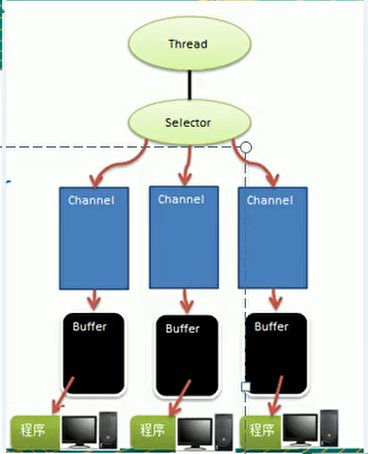
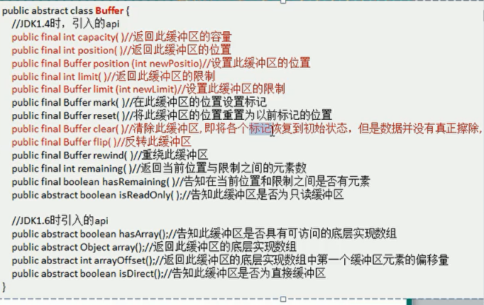
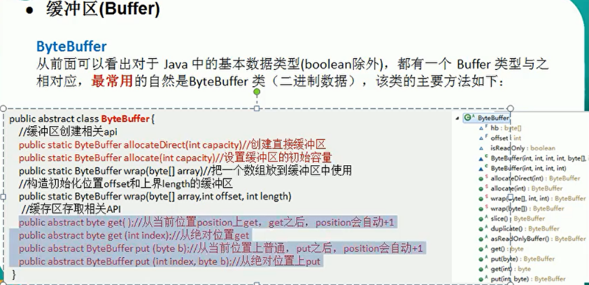
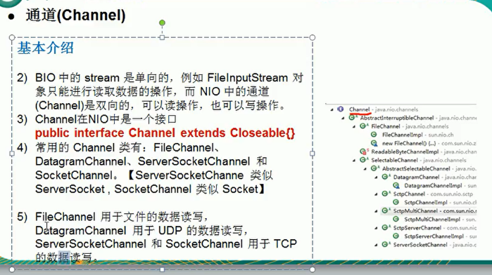

[JAVA IO 和 NIO](https://blog.csdn.net/feather_wch/article/details/82665902)

    1：阻塞IO
    2：非阻塞IO
    3：IO多路复用
    4：信号驱动
    5：异步IO

    BIO: 同步，阻塞
    NIO: 同步，非阻塞
    AIO(NIO2): 异步，非阻塞 - JDK1.7 后

    1：Java IO 是阻塞式的操作，当一个inputstream或outputstream在进行read（）或write（）操作时，
        是一直处于等待状态的，直到有数据读/写入后才进行处理。
        
       Java NIO 是非阻塞式的，多个通道，当进行读写操作时，只会返回当前已经准备好数据的通道，
        这样当前线程就可以处理其他的事情，提高了资源的使用率。
    
    2：Java NIO 是非阻塞式的，多个通道，当进行读写操作时，只会返回当前已经准备好数据的通道，
        这样当前线程就可以处理其他的事情，提高了资源的使用率。
    
       2.1：NIO的特性：非阻塞I/O，选择器，缓冲以及管道。
             2.1.1：Channel管道： 实际上就像传统IO中的流，到任何目的地(或来自任何地方)的所有数据都必须通过一个 Channel 对象。
             2.1.2：Buffer缓冲区： 实质上是一个容器对象。
             2.1.3：Selector选择器： 允许一个单独的线程来监视多个输入通道，你可以注册多个通道使用一个选择器，
                    然后使用一个单独的线程来“选择”通道：这些通道里已经有可以处理的输入，或者选择已准备写入的通道。
                    这种选择机制，使得一个单独的线程很容易来管理多个通道。
                    
                    

## NIO
            

    1: 每个Channel 都对应一个Buffer
    2: Selector 对应一个线程(可以理解为main线程 - 开创一个子线程 - Selector - 多个Channel(链接))
    3: 程序切换那个Channel 是有事件决定的，Event 是其中一个重要概念
    4: Seletor 会根据不同的事件，在各个通道上切换
    5: Buffer 是一个内存块，底层为数组
    6: 用户线程发起的读写，都是通过Buffer，然后BIO中，要么为输入流，要么输出流，不能双向。但NIO的Buffer
        和Channel 都是双向，即可以读也可以写，但Buffer， 需要使用filp() 方法切换成读模式。

### Buffer

### Channel
